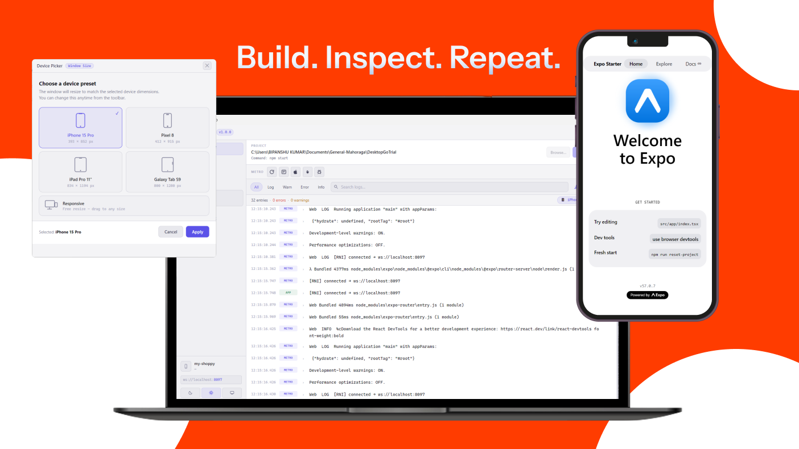

<div align="center">

# RN Inspector Pro

**A desktop devtool for React Native & Expo — run your project, inspect logs, preview on real device sizes, and replay past sessions.**

[](https://github.com/the-bipu/react-native-inspector-app)
[](LICENSE)
[](https://www.electronjs.org/)
[](https://github.com/the-bipu/react-native-inspector-app/releases)

</div>

---

## What is it?

RN Inspector Pro is a standalone Electron desktop application that acts as your all-in-one development companion for React Native and Expo projects. Instead of juggling multiple terminal windows, browser tabs, and bundler logs, you get a single clean interface that:

- **Starts and stops** your Metro bundler from a project directory you choose
- **Captures logs** streamed over WebSocket from your running app (iOS, Android, Web)
- **Previews** your running app in a resizable window sized to real device dimensions
- **Saves sessions** so you can replay and diff logs from previous runs

---

## Features

### Log Inspector
- Real-time log streaming via a built-in WebSocket server (`ws://localhost:8097`)
- Filter logs by level — `All`, `Log`, `Warn`, `Error`, `Info`
- Full-text search across all captured log entries
- Live counters for errors and warnings
- Export logs as **JSON** or **TXT**

### Device Preview
- Opens a separate window that loads your running app in a `<webview>`
- Choose from built-in device presets or drag to any size:

  | Preset | Dimensions |
  |---|---|
  | iPhone 15 Pro | 393 × 852 px |
  | Pixel 8 | 412 × 915 px |
  | iPad Pro 11" | 834 × 1194 px |
  | Galaxy Tab S9 | 800 × 1280 px |
  | Responsive | Free resize |

- Reload the preview or open browser DevTools from the toolbar

### Project Management
- Browse to any React Native / Expo project directory
- Auto-detects the right start command (`npx expo start`, `npx react-native start`, or `npm start`)
- Quick-access list of recent projects (up to 20, renameable)
- Detects when Metro is ready and shows the active port

### Metro Shortcuts
- Send keyboard commands directly to the Metro process (reload, open DevTools, etc.) without switching windows

### Session History
- Every run is automatically saved as a session with metadata (app name, platform, log/error/warn counts)
- Browse and replay any past session's full log stream
- Sessions are stored locally in your OS user-data directory

### Theming
- Light, Dark, and System-synced themes
- Theme preference is persisted across restarts

---

## Getting Started

### Prerequisites

- [Node.js](https://nodejs.org/) 18 or newer
- [npm](https://www.npmjs.com/) or compatible package manager

### Clone & Install

```bash
git clone https://github.com/the-bipu/react-native-inspector-app.git
cd react-native-inspector-app
npm install
```

### Run in Development

```bash
npm start
```

This launches the Electron app with hot-reload enabled. Any changes to source files will auto-refresh the window.

---

## Build & Distribution

Build distributable packages using [electron-builder](https://www.electron.build/):

```bash
# Current platform
npm run dist

# Windows (NSIS installer + APPX)
npm run build:win

# macOS (DMG)
npm run build:mac

# Linux
npm run build:linux
```

Output files are written to the `release/` directory.

> **Note:** The Windows APPX package is signed under `BipanshuKumar.ReactNativeInspector`. You may need to update the `publisher` field in `package.json` before building for your own distribution.

---

## How It Works

```
┌─────────────────────────────────┐
│        RN Inspector Pro          │
│  ┌──────────────────────────┐   │
│  │  Main Process (main.js)  │   │
│  │  - Spawns Metro process  │   │
│  │  - WebSocket server :8097│   │
│  │  - Session persistence   │   │
│  └────────────┬─────────────┘   │
│               │ IPC              │
│  ┌────────────▼─────────────┐   │
│  │  Renderer (index.html)   │   │
│  │  - Log viewer & filters  │   │
│  │  - Project manager       │   │
│  │  - Session history       │   │
│  └──────────────────────────┘   │
└─────────────────────────────────┘
         ▲
         │ ws://localhost:8097
         │
┌────────┴───────────┐
│  Your RN / Expo App │
│  (iOS / Android / Web)
└────────────────────┘
```

The app runs a WebSocket server on port `8097`. Your React Native app connects to this server and forwards all `console.log`, `warn`, `error`, and `info` calls. RN Inspector Pro renders them in real time.

---

## Project Structure

```
react-native-inspector-app/
├── main.js              # Electron main process — process management, IPC, WebSocket server
├── renderer.js          # Renderer process — UI logic, log rendering, session management
├── preload.js           # Context bridge — exposes safe IPC APIs to the renderer
├── index.html           # Main window UI
├── device-preview.html  # Device preview window (hosts the <webview>)
├── device-preview.js    # Preview window logic
├── picker.html          # Device preset picker dialog
├── picker.js            # Picker dialog logic
├── style.css            # Global styles + theme variables
├── assets/
│   └── icon.ico         # App icon
└── build/               # Build assets (icons, APPX logos)
```

---

## Contributing

Pull requests are welcome. For major changes, please open an issue first to discuss what you'd like to change.

1. Fork the repository
2. Create a feature branch (`git checkout -b feature/your-feature`)
3. Commit your changes (`git commit -m 'Add your feature'`)
4. Push to the branch (`git push origin feature/your-feature`)
5. Open a Pull Request

---

## License

This project is licensed under the [MIT License](LICENSE).

---

<div align="center">
Made with ❤️ by <a href="https://github.com/the-bipu">the-bipu</a>
</div>